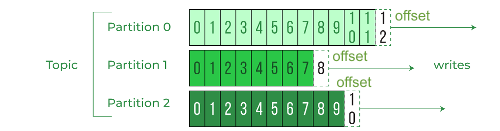
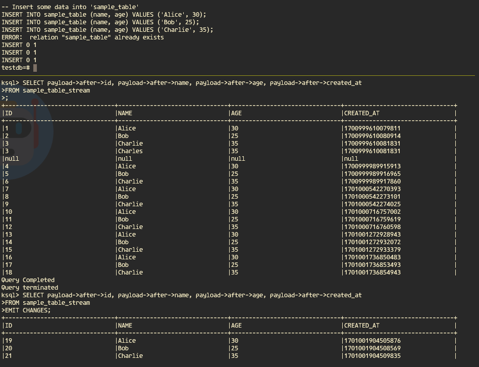
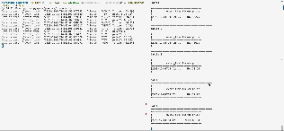

# Streaming Data Platform — Hands-On Lab

A four-part, build-it-yourself walkthrough of a modern streaming stack: message brokers,
change data capture, stream SQL, and Spark Structured Streaming. Every part is a working
`docker-compose` environment plus the notes explaining *why* each piece is there.

Everything runs locally. No cloud account required.

---

## Stack

| Layer | Tool |
|---|---|
| Broker | Redpanda (Kafka API compatible) — `redpandadata/redpanda:v23.2.14` |
| Broker UI | Redpanda Console `v2.3.1` |
| CDC | Debezium Connect → PostgreSQL 12 logical replication |
| Stream SQL | ksqlDB (server + CLI) |
| Stream processing | Apache Spark 3 (Bitnami), PySpark Structured Streaming |
| Producers/consumers | Python (`kafka-python`), containerised |

---

## The four days

### [Day 1 — Introduction to Message Brokers](streaming-day-1.md)
Point-to-point (queue, push-based) vs publish/subscribe (topic, pull-based); topics,
partitions and offsets; why consumers own their checkpoint. Ends with a running Redpanda
cluster and a produce/consume round trip.



**Hands-on ([TASK 1](TASK%201)):** create a topic, produce and consume records, verify them
in the Console dashboard and in the broker log.

### [Day 2 — Change Data Capture with Debezium](streaming-day-2.md)
Set PostgreSQL `wal_level = logical`, register a Debezium connector, and watch row-level
`INSERT` / `UPDATE` / `DELETE` arrive on a topic as change events — no polling, no
`updated_at` column, no dual writes.

**Hands-on ([TASK 2](TASK%202)):** create a table, insert/update/delete rows, and confirm each
operation surfaces as its own change event in the dashboard.

### [Day 3 — Stream SQL with ksqlDB](streaming-day-3.md)
Declare streams over topics, apply a schema, and query a moving feed with SQL. Covers the
Schema Registry and the stream-vs-table distinction.



### [Day 4 — Streaming with Apache Spark](streaming-day-4.md)
Spark architecture, then a full pipeline: a Python producer writes stock ticks as JSON to
`stock_json_topic_spark`, and a PySpark consumer reads the topic with `readStream`, applies a
`StructType` schema via `from_json`, and expands the value column into typed fields.



---

## Layout

```
streaming-day-{1..4}.md    the notes for each part
docker/redpanda/           redpanda + console + debezium + ksqldb compose files
docker/spark/              spark master/worker compose file
pyspark/produce/           JSON stock-tick producer (+ Dockerfile)
pyspark/consume/           Structured Streaming consumer (+ Dockerfile)
pubsub/json/               plain kafka-python producer/consumer and config
TASK 1/, TASK 2/           hands-on exercise walkthroughs (screenshots)
img/                       diagrams and dashboard captures
```

## Running it

```bash
# Day 1–3: broker, console, CDC, stream SQL
docker compose -f docker/redpanda/docker-compose.yml up -d

# Day 4: broker + spark together
docker compose -f docker/redpanda/docker-compose-spark.yml up -d
docker compose -f docker/spark/docker-compose.yml up -d

# produce, then consume
python pyspark/produce/produce.py
spark-submit --packages org.apache.spark:spark-sql-kafka-0-10_2.12:3.3.0 pyspark/consume/consume.py
```

The Redpanda Console is on <http://localhost:8080>, the Spark master UI on
<http://localhost:8081>.

> Bootstrap servers are `localhost:19092` from the host and `redpanda:9092` from inside the
> compose network — check which one your script needs.
